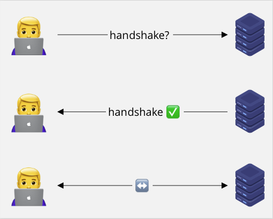
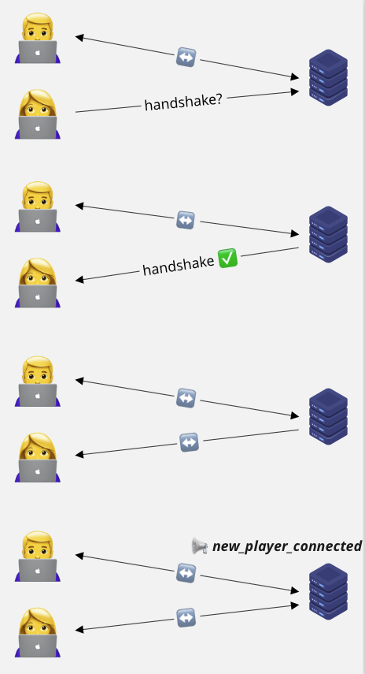
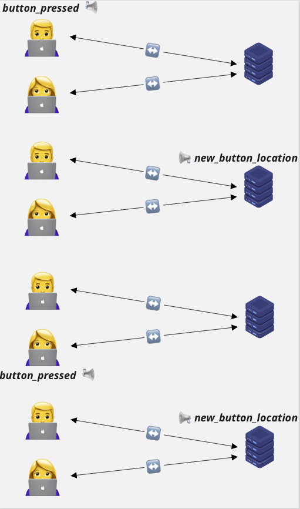
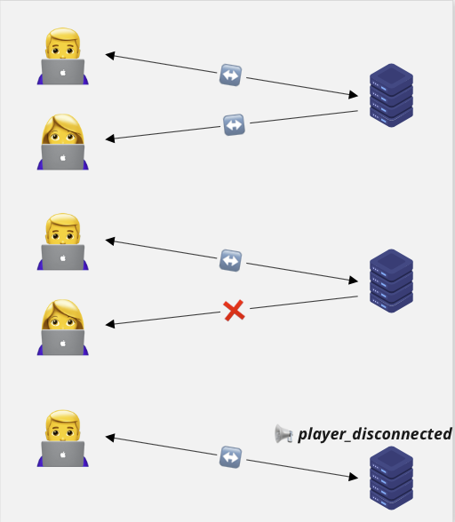

# Our Crazy Button Architecture

1. Your laptop make request to server for handshake
2. Server respond with handshake confirmation
3. Server push data to your client when:
   - a new player join
   - the button was clicked
   - a player has left
4. Your laptop process on data received from server

## Initial connection

## A new player connected

## The button was pressed

## A player disconnected

